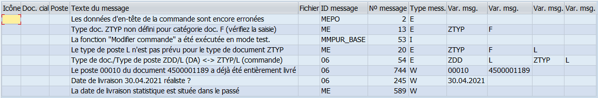
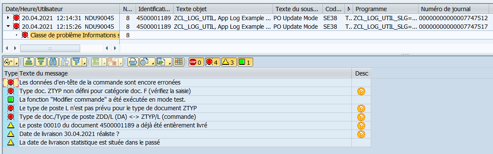

# ABAP Logging Class ZCL_LOG_UTIL

> An another ABAP logging class allowing programs to focus on their functionality
> rather than being buried under lines of logging code.

**Link to download latest versions** :

* Latest : [v0.1.1 (Latest)](https://github.com/neooblaster/zcl_log_util/releases/tag/latest)
* Latest ABAP 7.30 : [v0.1.1 for ABAP 7.30 (Latest)](https://github.com/neooblaster/zcl_log_util/releases/tag/latest-7.30)


## Summary

[](BeginSummary)
* [Summary](#summary)
* [Feature Overview](#feature-overview)
* [Introduction : Genesis of this class](#introduction-:-genesis-of-this-class)
* [Installation](#installation)
* [Getting Start](#getting-start)
    * [Initialization](#initialization)
    * [Logging & Display](#logging-&-display)
* [Detailed documentation](#detailed-documentation)
    * [Instantiation methods](#instantiation-methods)
    * [Logging methods](#logging-methods)
        * [Logging system message](#logging-system-message)
        * [Logging next to statement ``MESSAGE``](#logging-next-to-statement-message)
        * [Logging a structure](#logging-a-structure)
        * [Logging a table](#logging-a-table)
        * [Logging using message class](#logging-using-message-class)
        * [Logging a free text message](#logging-a-free-text-message)
    * [Logging in the Application Log (`SLG1`)](#logging-in-the-application-log-slg1)
        * [Configuration](#configuration)
            * [Set the main object](#set-the-main-object)
            * [Set the sub-object](#set-the-sub-object)
            * [Set the external number](#set-the-external-number)
            * [Set the log retention time](#set-the-log-retention-time)
        * [Enabling / Disabling](#enabling-/-disabling)
        * [Display Application Log](#display-application-log)
    * [Overloading Log Messages](#overloading-log-messages)
        * [Explanations about overloading feature](#explanations-about-overloading-feature)
            * [Overloading Modes](#overloading-modes)
        * [Configuration](#configuration)
        * [Enabling / Disabling](#enabling-/-disabling)
        * [Using Spot ID](#using-spot-id)
        * [Using Extra parameters](#using-extra-parameters)
        * [Using your own custom setting table](#using-your-own-custom-setting-table)
        * [Overloading an already filled log table](#overloading-an-already-filled-log-table)
    * [Managing batch mode outputs](#managing-batch-mode-outputs)
        * [Managing output for the spool](#managing-output-for-the-spool)
        * [Managing output for the protocol](#managing-output-for-the-protocol)
    * [Set your own definitions](#set-your-own-definitions)
        * [Set a custom log table type or unregistred SAP standard type](#set-a-custom-log-table-type-or-unregistred-sap-standard-type)
        * [Set a custom setting table that storing overloading rules](#set-a-custom-setting-table-that-storing-overloading-rules)
    * [Extra feature](#extra-feature)
        * [Display the content of any kind of internal table](#display-the-content-of-any-kind-of-internal-table)
[](EndSummary)


## Feature Overview

* Logging messages in own internal table type :
    * Next to statement ``MESSAGES``.
    * System message stored in global structure ``SY``.
    * Standard **BAPI** return structure or table (eg `BAPIRET2`).
    * Custom return structure or table.
    * A free message texte.
    * A message using a message class.
* Logging messages in **Application Log** (TCODE : `SLG1`) .
* Displaying logs in the report :
    * In an ALV grid from your own log table.
        * The method can be used to display any kind of internal table.
    * In the same presentation of ``SLG1`` from **Application Log**.
* Managing logs between **foreground** and **background** execution (**batch**) :
    * For **batch** mode, you can easily set which message type must be displayed 
    in the **spool** and in the **protocol** in an independent way.
* The best for the end, overloading logs messages using provided settings table
or your own one :
    * Update messages components on the fly according to the rules in settings table.
    * Skip messages.
    * Appending an extra message.
    * Messages can be uniquely identified by using a Spot ID in your program. 


## Introduction : Genesis of this class

As part of the development of ABAP interfaces program executed by batch, 
we have been confronted several times with subjects around error logs.
First, we had problems with their display between the area of ​​the job 
execution protocol and those to display in the spool to send an email. 
Later we had a request to handle standard BAPI error messages being significant 
as false positive. 
Finally for an advanced follow-up for possible anomaly analysis in production, 
the use of the application can be a precious help.

All of its subjects are at the very close ABAP level (message management) 
but the implementation varies greatly depending on the nature of the subject. 
The reuse of codes is very complex because of its processive implementation.

The need to develop a class designed to cover all needs, 
without modifying the way of logging into the program and leaving the core of 
the program readable has become evident. 
It is for this reason that I decided to develop the ``ZCL_LOG_UTIL`` class. 
It is intended to be easy to use (minimum configuration) 
while offering a range of functions (requires more configuration, 
but always wants to be as simple as possible). 
Due to this complexity,
please find detailed documentation of the class and its use.


## Installation

1. Install this project via [ABAPGit](http://abapgit.org/).
2. Create **Application Log object** in transaction code ``SLG0`` :
    * Object : ``ZLOGUTIL`` (`Main default object for entries registred with ZCL_LOG_UTIL`).
3. Run the report : ``ZCL_LOG_UTIL_INSTALL`` to fill the default table 
`ZLOG_UTIL_OVERLO` of the class for example report.

Now you're ready to get started.


## Getting Start

The ``ZCL_LOG_UTIL`` project comes with an example program that contains and 
uses all of the functionality offered by the class. 
Its goal is to allow all users to have an example of a precise use, 
method call or implementation of a feature for their projects. 
There is nothing worse than having the method without understanding how to use 
it.

First follow the guide to understand its use in its simplest form before using 
the ``ZCL_LOG_UTIL_EXAMPLES`` (``SE38`` / ``SE80``) example program.
I will mention which demo contain the appropriate code explain in this guide.


### Initialization

For the simplest possible use,
I advise you to use the type of log table provided with the class.
Instantiation works in the same way as that of an ALV grid of class 
``CL_SALV_TABLE`` :

````abap
" Data declaration :
DATA: lt_log_table TYPE TABLE OF zcl_log_util=>ty_log_table ,
      lr_log_util  TYPE REF TO   zcl_log_util               .

" Instanciation
zcl_log_util=>factory(
    IMPORTING
        e_log_util  = lr_log_util
    CHANGING
        c_log_table = lt_log_table
).
````

> Available in ``Demo 010``.


### Logging & Display

To log messages, there are a number of different ways to proceed.
I advise you to do it in the following way.
This method offers the advantage of being able to do the where-used on the
message class and on the message number, 
a powerful feature of SAP.

````abap
" Creating a variable to catch generated message
DATA: lv_dummy TYPE string .

" Raising message :
"   - 1.) Message texte is available in lv_dummy.
"   - 2.) Log raised message
MESSAGE e504(vl) INTO lv_dummy.
lr_log_util->log( ).

" Display you log table
lr_log_util->display( ).
````

**Hints** : When you use statement ``MESSAGE``, SAP automatically feed
structure ``SY``. Using `lr_log_util->log( )` will log message using the message 
components available in structure ``SY``.
When a standard **Function Module** or **BAPI** implicitely
stored errors in ``SY`` you can log system message using `log( )` method
without writing statement ``MESSAGE``.

> Available in ``Demo 010``.


## Detailed documentation


### Instantiation methods

There are two ways to instantiate the ``ZCL_LOG_UTIL`` class.
The first method will be the most frequent method.
The second method makes it possible to defer the association of the internal 
table to a later moment in the processing of the program.
It also offers a way to change log tables at any time which allows you to use 
a single instance to manage different internal tables.

* First method : classic way, same as chapter ``Getting Start``

````abap
" Data declaration :
DATA: lt_log_table TYPE TABLE OF zcl_log_util=>ty_log_table ,
      lr_log_util  TYPE REF TO   zcl_log_util               .

" Instanciation (making link between instance and internal table)
zcl_log_util=>factory(
    IMPORTING
        e_log_util  = lr_log_util
    CHANGING
        c_log_table = lt_log_table
).
````

> Available in ``Demo 010``.

* Second method : differed way, for multiple log table in one report.

````abap
# -----[ Instanciation ]---------------------------------------
" Data declaration :
DATA: lr_log_util  TYPE REF TO   zcl_log_util .

" Instanciation
zcl_log_util=>factory(
    IMPORTING
        e_log_util  = lr_log_util
).
````

````abap
# -----[ Linking log table ]-----------------------------------
" Data declaration :
DATA: lt_log_table TYPE TABLE OF zcl_log_util=>ty_log_table .

" Linking log table :
lr_log_util->set_log_table(
    CHANGING
        t_log_table = lt_log_table
).
````

> Available in ``Demo 065``.


### Logging methods

The main objective of this class is to provide the maximum possibility of
logging different message sources with different format types using only one method.
Here are the ways to log messages using the instance reference `lr_log_util`
of class ``zcl_log_util``.


#### Logging system message

By definition, system message are stored in the global system structure ``SY``.
Calling the method ``log( )``, without import parameter will add the 
system message to the linked log table :

````abap
" Log system message
lr_log_util->log( ).
````

> Available in ``Demo 010``.


#### Logging next to statement ``MESSAGE``

As mentioned previously, the statement ``MESSAGE`` will update
the global system structure.
So to log the message in the log table simplify do as following :

````abap
" Done like this, the message will be redirected into lv_dummy as string.
MESSAGE i123(zmm01) WITH 'message' 'components' INTO DATA(lv_dummy).
lr_log_util->log( ).
````

> Available in ``Demo 010``.

From my point of view, this is the best way to register an entry in the log table,
because the here before statement will respond to the _where-used_ case.


#### Logging a structure

You can log any kind of **structure** as long as you have defined the field roles.
The ``zcl_log_util`` class already knows the field roles of the SAP standard
message structure (and table).

[](#import>zcl_log_util_known_structure.md)
Please find below structure which are natively handle by ``zcl_log_util`` :

| Name | Msg. Text | Msg. Type | Msg. ID | Msg. Number | Msg. Val. 1 | Msg. Val. 2 | Msg. Val. 3 | Msg. Val. 4 |
|---|---|---|---|---|---|---|---|---|
| zcl_log_util=>ty_log_table | MESSAGE | TYPE | ID | NUMBER | MSGV1 | MSGV2 | MSGV3 | MSGV4 | 
| sy | - | MSGTY | MSGID | MSGNO | MSGV1 | MSGV2 | MSGV3 | MSGV4 | 
| prott | - | MSGTY | MSGID | MSGNO | MSGV1 | MSGV2 | MSGV3 | MSGV4 | 
| bapiret1 | MESSAGE | TYPE | ID | NUMBER | MESSAGE_V1 | MESSAGE_V2 | MESSAGE_V3 | MESSAGE_V4 | 
| bapiret2 | MESSAGE | TYPE | ID | NUMBER | MESSAGE_V1 | MESSAGE_V2 | MESSAGE_V3 | MESSAGE_V4 | 
| bapi_coru_return | - | TYPE | ID | NUMBER | MESSAGE_V1 | MESSAGE_V2 | MESSAGE_V3 | MESSAGE_V4 | 
| bapi_order_return | - | TYPE | ID | NUMBER | MESSAGE_V1 | MESSAGE_V2 | MESSAGE_V3 | MESSAGE_V4 | 
| bdcmsgcoll | - | MSGTYP | MSGID | MSGNR | MSGV1 | MSGV2 | MSGV3 | MSGV4 | 

See chapter ``Set your own definitions`` / `Set a custom log table type or unregistred SAP standard type`
[Jump](README.md#)

[](#import<zcl_log_util_known_structure.md)

````abap
DATA ls_bapiret2 TYPE bapiret2.

" Considering ls_bapiret2 is not initial
lr_log_util->log( ls_bapiret2 ).
````


#### Logging a table

You can log any kind of **table** as long as you have defined the field roles.
The ``zcl_log_util`` class already knows the field roles of the SAP standard
message structure (and table).

[](#import>zcl_log_util_known_structure.md)
Please find below structure which are natively handle by ``zcl_log_util`` :

| Name | Msg. Text | Msg. Type | Msg. ID | Msg. Number | Msg. Val. 1 | Msg. Val. 2 | Msg. Val. 3 | Msg. Val. 4 |
|---|---|---|---|---|---|---|---|---|
| zcl_log_util=>ty_log_table | MESSAGE | TYPE | ID | NUMBER | MSGV1 | MSGV2 | MSGV3 | MSGV4 | 
| sy | - | MSGTY | MSGID | MSGNO | MSGV1 | MSGV2 | MSGV3 | MSGV4 | 
| prott | - | MSGTY | MSGID | MSGNO | MSGV1 | MSGV2 | MSGV3 | MSGV4 | 
| bapiret1 | MESSAGE | TYPE | ID | NUMBER | MESSAGE_V1 | MESSAGE_V2 | MESSAGE_V3 | MESSAGE_V4 | 
| bapiret2 | MESSAGE | TYPE | ID | NUMBER | MESSAGE_V1 | MESSAGE_V2 | MESSAGE_V3 | MESSAGE_V4 | 
| bapi_coru_return | - | TYPE | ID | NUMBER | MESSAGE_V1 | MESSAGE_V2 | MESSAGE_V3 | MESSAGE_V4 | 
| bapi_order_return | - | TYPE | ID | NUMBER | MESSAGE_V1 | MESSAGE_V2 | MESSAGE_V3 | MESSAGE_V4 | 
| bdcmsgcoll | - | MSGTYP | MSGID | MSGNR | MSGV1 | MSGV2 | MSGV3 | MSGV4 | 

See chapter ``Set your own definitions`` / `Set a custom log table type or unregistred SAP standard type`
[Jump](README.md#)

[](#import<zcl_log_util_known_structure.md)

````abap
DATA lt_bapiret2 TYPE TABLE OF bapiret2.

" Considering lt_bapiret2 is not initial
lr_log_util->log( lt_bapiret2 ).
````

> Available in ``Demo 040``.


#### Logging using message class

The class offer the possibility to register a new entry in your log table 
by passing message components directly in the import parameter of the
method ``log( )``.

Be aware that "where-used" will not be able to find the message

````abap
lr_log_util->log(
    IMPORTING
        i_log_msgid = 'zmm01'
        i_log_msgno = '123'
        i_log_msgty = 'I'
        i_log_msgv1 = 'Message'
        i_log_msgv2 = 'Component'
*        i_log_msgv3 = 'optional'
*        i_log_msgv4 = 'optional'
)
````


#### Logging a free text message

If you have a simple text or a variable which contains your text message
you can register it in the log table.

Note : The class is not able to find back the message components, so in the log
table you will only find the message in the message column.

````abap
lr_log_util->log( 'My free text message' ).
````


### Logging in the Application Log (`SLG1`)

The ``zcl_log_util`` class can be used as library
to handle logging throught **Application Log**. 
Indeed, all registered messages from method ``log( )``,
can be stored in a **Application Log** ledger.

This is not the maim purpose of this class,
so some settings steps must be perform to enable
**Application Log**.


#### Configuration

At least, to create a **Application Log** register,
we have to set the **main object** and eventually one of its
**sub-object**.

By default, ``zcl_log_util`` use the default **main object**
``ZLOGUTIL`` which you have created in during `Installation` step
thanks to ``SLG0``.

So at least, you can simply **enable** the **Application log**,
but I advise to use your own ``SLG`` objects.

To handle **Application Log** from ``zcl_log_util``,
you can define a local reference to simplify the code writing 
or make direct call from your instance.

Here we will use a local reference `lr_slg` to increase code readability :

````abap
DATA lr_slg TYPE REF TO zcl_log_util_slg.

lr_slg = lr_log_util->slg( ).
````

> Available in ``Demo 070``.


##### Set the main object

To set/change your own **main object**,
simply use the method ``set_object( )`` :

````abap
" Main object ZMYPO must be exist in SLG0.
lr_slg->set_object( 'ZMYPO' ).
````

> Available in ``Demo 070``.


##### Set the sub-object

To set/change the **sub-object**,
simply use the method ``set_sub_object( )`` :

````abap
" Sub-object 'PO_CHANGE' must be a sub-obecjt of 'ZMYPO'.
lr_slg->set_sub_object( 'PO_CHANGE' ).
````

> Available in ``Demo 070``.


##### Set the external number

The **external number** is optionnal.
Its helps to reduce result when you search for log in ``SLG1``.
For instance, you can set the **PO Number** as **external number** :

````abap
lr_slg->set_external_number( '4500001189' ).
````

> Available in ``Demo 070``.


##### Set the log retention time

The retention delay is required for the garbage collector
to delete old log.
By default, the retention is set to ``30`` days.

````abap
lr_slg->set_retention( 60 ).
````

> Available in ``Demo 070``.


#### Enabling / Disabling

You can enable / disable at anytime the recording of log message
in the **Application Log**.

Simply use method ``enable( )`` to activate the functionality and
``disabled( )`` to turn off recording.

````abap
" Turn on Application Log
lr_slg->enable(  ).
````
````abap
" Turn off Application Log
lr_slg->disable(  ).
````

> Available in ``Demo 070``.

Enabling / Disabling **Application Log** will not close the register.
Register is saved at the end of the program.


#### Display Application Log

If you want to display the **Application Log** in your report
to avoid using TCODE ``SLG1``, simply call method `display( )`.

````abap
" Display the Application Log register
lr_slg->display(  ).
````

> Available in ``Demo 070``.

Result in your own log table :



Result in **Application Log** using ``display( )`` :




### Overloading Log Messages


#### Explanations about overloading feature


##### Overloading Modes


#### Configuration


#### Enabling / Disabling


#### Using Spot ID


#### Using Extra parameters


#### Using your own custom setting table


#### Overloading an already filled log table


### Managing batch mode outputs


#### Managing output for the spool


#### Managing output for the protocol


### Set your own definitions


#### Set a custom log table type or unregistred SAP standard type


#### Set a custom setting table that storing overloading rules


### Extra feature


#### Display the content of any kind of internal table


