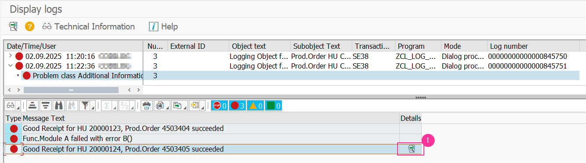
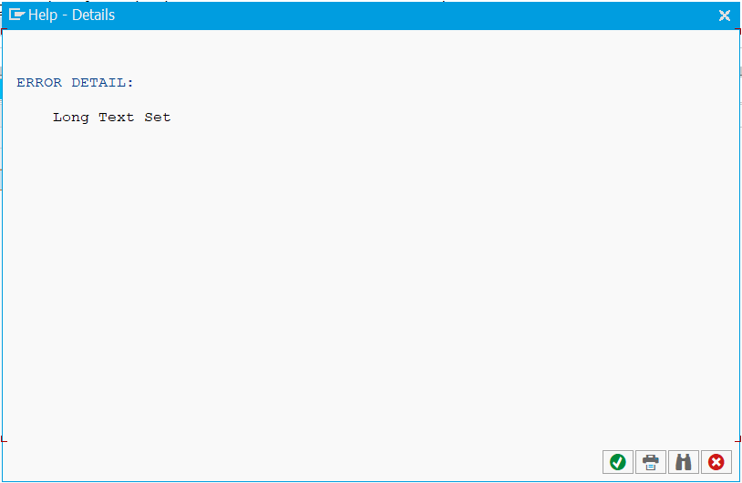
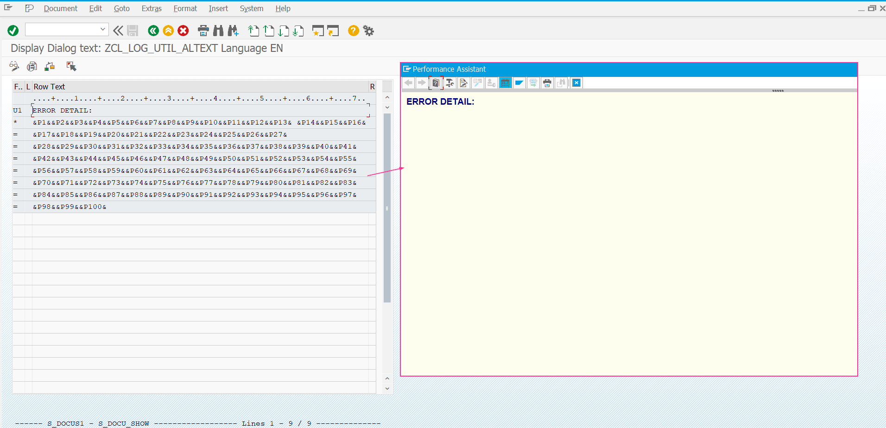
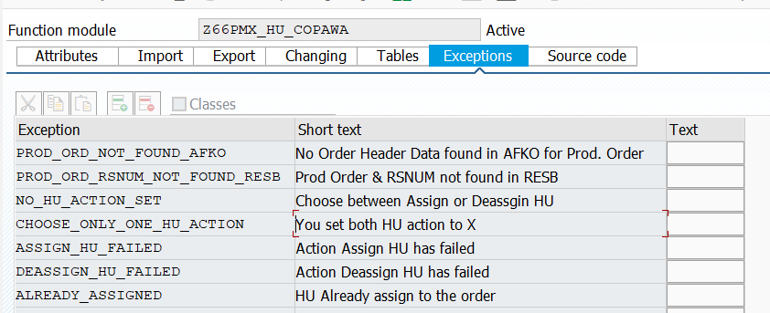
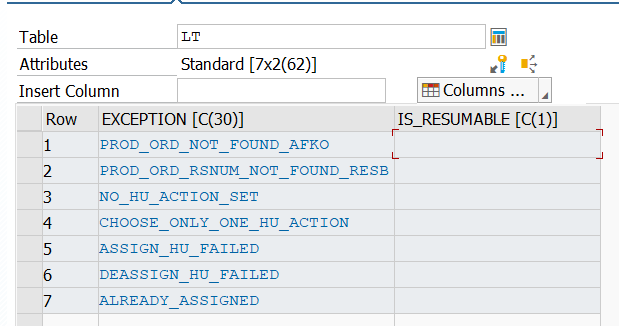
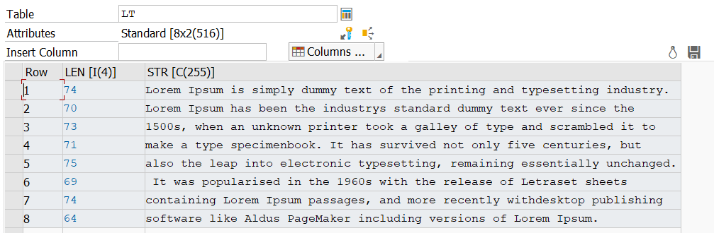
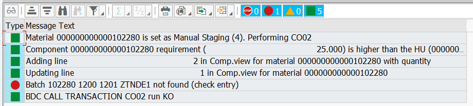
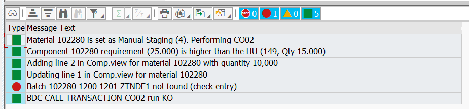

# ABAP Logging Class ZCL_LOG_UTIL

> An ABAP logging class allows programs to focus on their functionality
> rather than being buried under the lines of logging code.

**Link to download latest versions** :

* Latest : [v0.2.0 (Latest)](https://github.com/neooblaster/zcl_log_util/releases/tag/latest)
* Latest ABAP 7.30 : [v0.1.1 for ABAP 7.30 (Latest)](https://github.com/neooblaster/zcl_log_util/releases/tag/latest-7.30)

> New feature from v0.2.0 : ``Application Log - Long Text``

## Summary

[](BeginSummary)
* [Summary](#summary)
* [Features Overview](#features-overview)
* [Demonstration reports (`SE38`)](#demonstration-reports-se38)
* [Introduction: Genesis of this class](#introduction-genesis-of-this-class)
* [Installation](#installation)
* [Getting Start](#getting-start)
    * [Initialization](#initialization)
    * [Logging & Display](#logging--display)
* [Detailed documentation](#detailed-documentation)
    * [Definition of log message](#definition-of-log-message)
    * [Instantiation methods](#instantiation-methods)
    * [Logging methods](#logging-methods)
        * [Logging system message](#logging-system-message)
        * [Logging next to statement ``MESSAGE``](#logging-next-to-statement-message)
        * [Logging a structure](#logging-a-structure)
        * [Logging a table](#logging-a-table)
        * [Logging using message class](#logging-using-message-class)
        * [Logging a free text message](#logging-a-free-text-message)
        * [Quick loggers](#quick-loggers)
        * [Adding non message components to your log entries](#adding-non-message-components-to-your-log-entries)
    * [Logging in the Application Log (`SLG1`)](#logging-in-the-application-log-slg1)
        * [Configuration](#configuration)
            * [Set the main object](#set-the-main-object)
            * [Set the sub-object](#set-the-sub-object)
            * [Set the external number](#set-the-external-number)
            * [Set the log retention time](#set-the-log-retention-time)
        * [Enabling / Disabling](#enabling--disabling)
        * [Display Application Log](#display-application-log)
        * [Working with Long Text](#working-with-long-text)
    * [Overloading Log Messages](#overloading-log-messages)
        * [Explanations about overloading feature (Theoretical Part)](#explanations-about-overloading-feature-theoretical-part)
            * [Set Overloading Rules with Modes](#set-overloading-rules-with-modes)
                * [Altering the message component(s) (Mode `O`)](#altering-the-message-components-mode-o)
                * [Skipping the error message (Mode `I`)](#skipping-the-error-message-mode-i)
                * [Appending an extra message (Mode `A`)](#appending-an-extra-message-mode-a)
        * [Configuration (Technical Part)](#configuration-technical-part)
            * [Enabling / Disabling](#enabling--disabling)
            * [Set pre-filters](#set-pre-filters)
            * [Using Spot ID](#using-spot-id)
            * [Using Extra parameters](#using-extra-parameters)
            * [Using your own custom setting table](#using-your-own-custom-setting-table)
            * [Overloading an already filled log table](#overloading-an-already-filled-log-table)
    * [Managing batch mode outputs](#managing-batch-mode-outputs)
        * [Managing output for the spool](#managing-output-for-the-spool)
        * [Managing output for the protocol](#managing-output-for-the-protocol)
    * [Set your own definitions](#set-your-own-definitions)
        * [Set a custom log table type or unregistred SAP standard type](#set-a-custom-log-table-type-or-unregistred-sap-standard-type)
        * [Set a custom setting table that storing overloading rules](#set-a-custom-setting-table-that-storing-overloading-rules)
    * [Extra feature](#extra-feature)
        * [Side Util ``zcl_log_util=>get_func_module_exception``](#side-util-zcl_log_utilget_func_module_exception)
        * [Side Util ``zcl_log_util=>get_func_module_exception_text``](#side-util-zcl_log_utilget_func_module_exception_text)
        * [Side Util ``zcl_log_util=>get_func_module_exceptions``](#side-util-zcl_log_utilget_func_module_exceptions)
        * [Side Util ``zcl_log_util=>split_text_to_chunks``](#side-util-zcl_log_utilsplit_text_to_chunks)
        * [Side Util ``zcl_log_util=>msgvx_simplify``](#side-util-zcl_log_utilmsgvx_simplify)
[](EndSummary)


## Features Overview

* Logging messages in own internal table type :
    * Next to statement ``MESSAGES``.
    * System message stored in global structure ``SY``.
    * Standard **BAPI** return structure or table (eg `BAPIRET2`).
    * Custom return structure or table.
    * A free message text.
    * A message using a message class.
* Logging messages in **Application Log** (TCODE : `SLG1`) :
    * Message can receive a long text (basic or customized)
* Displaying logs in the report :
    * In an ALV grid from your own log table.
        * The method can be used to display any kind of internal table.
    * In the same presentation of ``SLG1`` from **Application Log**.
* Managing logs between **foreground** and **background** execution (**batch**) :
    * For **batch** mode, you can easily set which message type must be displayed 
    in the **spool** and in the **protocol** in an independent way.
* The best for the end, overloading logs messages using provided settings table
or your own one :
    * Update messages components on the fly according to the rules in settings table.
    * Skip messages.
    * Appending an extra message.
    * Messages can be uniquely identified by using a Spot ID in your program. 


## Demonstration reports (`SE38`)

* ``ZCL_LOG_UTIL_EXAMPLES`` : `Class ZCL_LOG_UTIL usage case examples`
    * Demo 010 — Get started
    * Demo 020 — Logging using own tab
    * Demo 030 — Adding extra data
    * Demo 040 — Logging BAPI return tab
    * Demo 050 — Logging BAPI table with data
    * Demo 060 — Many entries with data
    * Demo 065 — Many Log Tables
    * Demo 090 — Logging Specifying typ
    * Demo 100 — Overloading messages
    * Demo 105 — Overwrite, Adding & Ignore
    * Demo 110 — Overwrite using own table
    * Demo 120 — Overwrite using Spot ID
    * Demo 130 — Overwrite exist log tab
    * Demo 140 — Overwrite Prefilter and params
    * Demo 150 — Logging for Batch Job
    * Demo 160 — Managing Batch Output
* ``ZCL_LOG_UTIL_EXAMPLES_SLG`` : `Class ZCL_LOG_UTIL - Application Log (SLG) usage case examples`
    * Demo 070 — Application Log SLG
    * Demo 080 — Enable/Disable SLG
    * Demo 085 — Application Log using Long Text


    
## Introduction: Genesis of this class

As part of the development of ABAP interfaces program executed by batch, 
we have been confronted several times with subjects around error logs.
First, we had problems with their display between the area of the job 
execution protocol and those to display in the spool to send an email. 
Later we had a request to handle standard BAPI error messages being significant 
as false positive. 
Finally, for an advanced follow-up for possible anomaly analysis in production, 
the use of the application can be a precious help.

All of its subjects are at the very close ABAP level (message management),  
but the implementation varies greatly depending on the nature of the subject. 
The reuse of codes is very complex because of its processive implementation.

The need to develop a class designed to cover all needs, 
without modifying the way of logging into the program and leaving the core of 
the program readable has become clear. 
It is for this reason that I decided to develop the ``ZCL_LOG_UTIL`` class. 
It is intended to be straightforward to use (minimum configuration) 
while offering a range of functions (requires more configuration, 
but always wants to be as simple as possible). 
Due to this complexity,
please find detailed documentation of the class and its use.


## Installation

1. Install this project via [ABAPGit](http://abapgit.org/).
2. Create **Application Log object** in transaction code ``SLG0`` :
    * Object : ``ZLOGUTIL`` (`Main default object for entries registred with ZCL_LOG_UTIL`).
3. Run the report : ``ZCL_LOG_UTIL_INSTALL`` to fill the default table 
`ZLOG_UTIL_OVERLO` of the class for example report.
4. The table maintenance view must be created manually thanks to transaction `SE11` (See: [Table Maintenance Generator](https://blogs.sap.com/2022/06/17/getting-started-with-abap-table-maintenance-generator/))

Now you're ready to get started.


## Getting Start

The ``ZCL_LOG_UTIL`` project comes with example programs that contain and 
uses all functionalities offered by the class. 
Its goal is to allow all users to have an example of a precise use, 
method call or implementation of a feature for their projects. 
There is nothing worse than having the method without understanding how to use 
it.

First follow the guide to understand its use in its simplest form before using 
the ``ZCL_LOG_UTIL_EXAMPLES`` (``SE38`` / ``SE80``) example program.
I will mention whose demo contains the appropriate code explained in this guide.


### Initialization

For the simplest possible use,
I advise you to use the type of log table provided with the class.
Instantiation works in the same way as that of an ALV grid of class 
``CL_SALV_TABLE`` :

````abap
" Data declaration :
DATA: lt_log_table TYPE TABLE OF zcl_log_util=>ty_log_table ,
      lr_log_util  TYPE REF TO   zcl_log_util               .

" Instanciation
zcl_log_util=>factory(
    IMPORTING
        e_log_util  = lr_log_util
    CHANGING
        c_log_table = lt_log_table
).
````

> Available in ``Demo 010``.


### Logging & Display

To log messages, there are a number of different ways to proceed.
I advise you to do it in the following way.
This method offers the advantage of being able to do the where-used on the
message class and on the message number, 
a powerful feature of SAP.

````abap
" Creating a variable to catch generated message
DATA: lv_dummy TYPE string .

" Raising message :
"   - 1.) Message texte is available in lv_dummy.
"   - 2.) Log raised message
MESSAGE e504(vl) INTO lv_dummy.
lr_log_util->log( ).

" Display you log table
lr_log_util->display( ).
````

**Hints** : When you use statement ``MESSAGE``, SAP automatically feed
structure ``SY``. Using `lr_log_util->log( )` will log a message using the message 
components available in structure ``SY``.
When a standard **Function Module** or **BAPI** implicitly
stored errors in ``SY`` you can log system message using `log( )` method
without writing statement ``MESSAGE``.

> Available in ``Demo 010``.


## Detailed documentation


### Definition of log message

A log message in **SAP** is an integral part of the system that is very
well-designed.
In the most basic usage case, they are used to handle the program logic errors
to inform (`I`), warn (`W`) or interrupt (`E` or `A`) the program.

Texts messages are stored in a **class message** (`ID`) which associates them
with a **number**. The message text can have until four variables placeholders (`&`).

The class message also handles the internationalization.

The best practice is to use a class message to manage your own custom messages.
You can raise the message by specifying the **type** or generate a text message
for a **log registry** (internal table for final display or any purpose).

Keep in mind the following message components with their roles :

* ``TYPE`` : Defines the kind of the message :
    * ``A`` (`Abort`) which will interrupt the program.
    * ``E`` (`Error`) which will interrupt the program.
    * ``W`` (`Warning`) which will display a warning in status bar.
    It did not interrupt the rest of the program.
    * ``I`` (`Information`) which will display an information popup.
    It did not interrupt the rest of the program.
* ``ID`` : specifies the class message that contains the text
* ``NUMBER`` : This is the number of the message to get in the provided class
message (`ID`)
* ``MESSAGE VALUE 1`` : The message text variable to put in placeholders
(first `&` or `&1`).
* ``MESSAGE VALUE 2`` : The message text variable to put in placeholders
(second `&` or `&2`).
* ``MESSAGE VALUE 3`` : The message text variable to put in placeholders
(third `&` or `&3`).
* ``MESSAGE VALUE 4`` : The message text variable to put in placeholders
(fourth `&` or `&4`).


### Instantiation methods

There are two ways to instantiate the ``ZCL_LOG_UTIL`` class.
The first method will be the most frequent method.
The second method makes it possible to defer the association of the internal 
table to a later moment in the processing of the program.
It also offers a way to change log tables at any time that allows you to use 
a single instance to manage different internal tables.

* First method : classic way, same as chapter ``Getting Start``

````abap
" Data declaration :
DATA: lt_log_table TYPE TABLE OF zcl_log_util=>ty_log_table ,
      lr_log_util  TYPE REF TO   zcl_log_util               .

" Instanciation (making link between instance and internal table)
zcl_log_util=>factory(
    IMPORTING
        e_log_util  = lr_log_util
    CHANGING
        c_log_table = lt_log_table
).
````

> Available in ``Demo 010``.

* Second method: differed way, for multiple log tables in one report.

````abap
# -----[ Instanciation ]---------------------------------------
" Data declaration :
DATA: lr_log_util  TYPE REF TO   zcl_log_util .

" Instanciation
zcl_log_util=>factory(
    IMPORTING
        e_log_util  = lr_log_util
).
````

````abap
# -----[ Linking log table ]-----------------------------------
" Data declaration :
DATA: lt_log_table TYPE TABLE OF zcl_log_util=>ty_log_table .

" Linking log table :
lr_log_util->set_log_table(
    CHANGING
        t_log_table = lt_log_table
).
````

> Available in ``Demo 065``.


### Logging methods

The main goal of this class is to provide the maximum possibility of
logging different message sources with different format types using only one method.
Here are the ways to log messages using the instance reference `lr_log_util`
of class ``zcl_log_util``.


#### Logging system message

By definition, system messages are stored in the global system structure ``SY``.
Calling the method ``log( )``, without import parameter will add the 
system message to the linked log table :

````abap
" Log system message
lr_log_util->log( ).
````

> Available in ``Demo 010``.


#### Logging next to statement ``MESSAGE``

As mentioned previously, the statement ``MESSAGE`` will update
the global system structure.
So to log the message in the log table, simply do as the following:

````abap
" Done like this, the message will be redirected into lv_dummy as string.
MESSAGE i123(zmm01) WITH 'message' 'components' INTO DATA(lv_dummy).
lr_log_util->log( ).
````

> Available in ``Demo 010``.

From my point of view, this is the best way to register an entry in the log table,
because the here-before statement will respond to the _where-used_ case.


#### Logging a structure

You can log any kind of **structure** as long as you have defined the field roles.
The ``zcl_log_util`` class already knows the field roles of the SAP standard
message structure (and table).

[](#import>zcl_log_util_known_structure.md)
Please find below structure that are natively handle by ``zcl_log_util`` :

| Name                       | Msg. Text | Msg. Type | Msg. ID | Msg. Number | Msg. Val. 1 | Msg. Val. 2 | Msg. Val. 3 | Msg. Val. 4 |
|----------------------------|-----------|-----------|---------|-------------|-------------|-------------|-------------|-------------|
| zcl_log_util=>ty_log_table | MESSAGE   | TYPE      | ID      | NUMBER      | MSGV1       | MSGV2       | MSGV3       | MSGV4       | 
| sy                         | -         | MSGTY     | MSGID   | MSGNO       | MSGV1       | MSGV2       | MSGV3       | MSGV4       | 
| prott                      | -         | MSGTY     | MSGID   | MSGNO       | MSGV1       | MSGV2       | MSGV3       | MSGV4       | 
| bapiret1                   | MESSAGE   | TYPE      | ID      | NUMBER      | MESSAGE_V1  | MESSAGE_V2  | MESSAGE_V3  | MESSAGE_V4  | 
| bapiret2                   | MESSAGE   | TYPE      | ID      | NUMBER      | MESSAGE_V1  | MESSAGE_V2  | MESSAGE_V3  | MESSAGE_V4  | 
| bapi_coru_return           | -         | TYPE      | ID      | NUMBER      | MESSAGE_V1  | MESSAGE_V2  | MESSAGE_V3  | MESSAGE_V4  | 
| bapi_order_return          | -         | TYPE      | ID      | NUMBER      | MESSAGE_V1  | MESSAGE_V2  | MESSAGE_V3  | MESSAGE_V4  | 
| bdcmsgcoll                 | -         | MSGTYP    | MSGID   | MSGNR       | MSGV1       | MSGV2       | MSGV3       | MSGV4       | 
| bdidocstat                 | -         | MSGTY     | MSGID   | MSGNO       | MSGV1       | MSGV2       | MSGV3       | MSGV4       | 

See chapter ``Set your own definitions`` / `Set a custom log table type or unregistred SAP standard type`
to register an unknown structure. [Jump](README.md#)

[](#import<zcl_log_util_known_structure.md)

````abap
DATA ls_bapiret2 TYPE bapiret2.

" Considering ls_bapiret2 is not initial
lr_log_util->log( ls_bapiret2 ).
````


#### Logging a table

You can log any kind of **table** as long as you have defined the field roles.
The ``zcl_log_util`` class already knows the field roles of the SAP standard
message structure (and table).

[](#import>zcl_log_util_known_structure.md)
Please find below structure which are natively handle by ``zcl_log_util`` :

| Name | Msg. Text | Msg. Type | Msg. ID | Msg. Number | Msg. Val. 1 | Msg. Val. 2 | Msg. Val. 3 | Msg. Val. 4 |
|---|---|---|---|---|---|---|---|---|
| zcl_log_util=>ty_log_table | MESSAGE | TYPE | ID | NUMBER | MSGV1 | MSGV2 | MSGV3 | MSGV4 | 
| sy | - | MSGTY | MSGID | MSGNO | MSGV1 | MSGV2 | MSGV3 | MSGV4 | 
| prott | - | MSGTY | MSGID | MSGNO | MSGV1 | MSGV2 | MSGV3 | MSGV4 | 
| bapiret1 | MESSAGE | TYPE | ID | NUMBER | MESSAGE_V1 | MESSAGE_V2 | MESSAGE_V3 | MESSAGE_V4 | 
| bapiret2 | MESSAGE | TYPE | ID | NUMBER | MESSAGE_V1 | MESSAGE_V2 | MESSAGE_V3 | MESSAGE_V4 | 
| bapi_coru_return | - | TYPE | ID | NUMBER | MESSAGE_V1 | MESSAGE_V2 | MESSAGE_V3 | MESSAGE_V4 | 
| bapi_order_return | - | TYPE | ID | NUMBER | MESSAGE_V1 | MESSAGE_V2 | MESSAGE_V3 | MESSAGE_V4 | 
| bdcmsgcoll | - | MSGTYP | MSGID | MSGNR | MSGV1 | MSGV2 | MSGV3 | MSGV4 | 

See chapter ``Set your own definitions`` / `Set a custom log table type or unregistred SAP standard type`
to register an unknown structure. [Jump](README.md#)

[](#import<zcl_log_util_known_structure.md)

````abap
DATA lt_bapiret2 TYPE TABLE OF bapiret2.

" Considering lt_bapiret2 is not initial
lr_log_util->log( lt_bapiret2 ).
````

> Available in ``Demo 040``.


#### Logging using message class

The class offer the possibility to register a new entry in your log table 
by giving message components directly in the import parameter of the
method ``log( )``.

Be aware that "where-used" will not be able to find the message

````abap
lr_log_util->log(
    IMPORTING
        i_log_msgid = 'zmm01'
        i_log_msgno = '123'
        i_log_msgty = 'I'
        i_log_msgv1 = 'Message'
        i_log_msgv2 = 'Component'
*        i_log_msgv3 = 'optional'
*        i_log_msgv4 = 'optional'
)
````


#### Logging a free text message

If you have a simple text or a variable that contains your text message,
you can register it in the log table.

Note: The class is unable to find back the message components, so in the log
table you will only find the message in the message column.

````abap
lr_log_util->log( 'My free text message' ).
````


#### Quick loggers

> Available in ``Demo 090``.


#### Adding non message components to your log entries

> Available in ``Demo 030``, `Demo 050`, `Demo 060`.


### Logging in the Application Log (`SLG1`)

The ``zcl_log_util`` class can be used as a library
to handle logging through **Application Log**. 
Indeed, all registered messages from method ``log( )``,
can be stored in an **Application Log** ledger.

This is not the main purpose of this class,
so some settings steps must be performed to enable
**Application Log**.

Note: The demonstration report for application log is
```ZCL_LOG_UTIL_EXAMPLES_SLG``` and contains the following demo :

* Demo 070 — Application Log SLG
* Demo 080 — Enable/Disable SLG
* Demo 085 — Application Log using Long Text


#### Configuration

At least, to create a **Application Log** register,
we have to set the **main object** and eventually one of its
**sub-objects**.

By default, ``zcl_log_util`` use the default **main object**
``ZLOGUTIL`` which you have created in during `Installation` step
thanks to ``SLG0``.

So at least, you can simply **enable** the **Application log**,
but I advise to use your own ``SLG`` objects.

To handle **Application Log** from ``zcl_log_util``,
you can define a local reference to simplify the code writing 
or make direct call from your instance.

Here we will use a local reference `lr_slg` to increase code readability :

````abap
DATA lr_slg TYPE REF TO zcl_log_util_slg.

lr_slg = lr_log_util->slg( ).
````

> Available in ``Demo 070``.


##### Set the main object

To set/change your own **main object**,
Use the method ``set_object( )`` :

````abap
" Main object ZMYPO must be exist in SLG0.
lr_slg->set_object( 'ZMYPO' ).
````

> Available in ``Demo 070``.


##### Set the sub-object

To set/change the **sub-object**,
Use the method ``set_sub_object( )`` :

````abap
" Sub-object 'PO_CHANGE' must be a sub-obecjt of 'ZMYPO'.
lr_slg->set_sub_object( 'PO_CHANGE' ).
````

> Available in ``Demo 070``.


##### Set the external number

The **external number** is optional.
Its helps to reduce the result when you search for log in ``SLG1``.
For instance, you can set the **PO Number** as **external number** :

````abap
lr_slg->set_external_number( '4500001189' ).
````

> Available in ``Demo 070``.


##### Set the log retention time

The retention delay is required for the garbage collector
to delete old log.
By default, the retention is set to ``30`` days.

````abap
lr_slg->set_retention( 60 ).
````

> Available in ``Demo 070``.


#### Enabling / Disabling

You can enable / disable at any time the recording of log message
in the **Application Log**.

Use method ``enable( )`` to activate the functionality and
``disabled( )`` to turn off recording.

````abap
" Turn on Application Log
lr_slg->enable(  ).
````
````abap
" Turn off Application Log
lr_slg->disable(  ).
````

> Available in ``Demo 070`` and `080`.

Enabling / Disabling **Application Log** will not close the register.
Register is saved at the end of the program.


#### Display Application Log

If you want to display the **Application Log** in your report
to avoid using TCODE ``SLG1``, call method `display( )`.

````abap
" Display the Application Log register
lr_slg->display(  ).
````

> Available in ``Demo 070``.

Result in your own log table :


Result in **Application Log** using ``display( )`` :


#### Working with Long Text

**Application Log** (`SLG`) can display an attached **Long Text**
for further detail regarding the logged message. It uses the defined long text
in the Class Message (``SE91``) but for free messages or if you want to change
it, now in version ``v0.2.0``, you can complete the log message with a **long 
text** :





As usual in this library, there are many different ways to set a long text
to answer to a maximum needs.

Before showing all possibilities to set it, let's talk about
long text first.

In SAP, long text can stand as detailed documentation about a message.
When the message is not **self-explanatory**, you can create a long text
in TCODE ``SE91``, button `Long Text`.
Application Log is able to attach it when it exists
You can also edit it in ``SE61``, with type `NA`(`Message`) 
entering the **Class Message ID** and the number.
But for custom **Long Text**, we are using the type ``DT`` (`Dialog Text`)
in ``SE61``. `ZCL_LOG_UTIL` comes with it own default **Dialog Text**
``ZCL_LOG_UTIL_ALTEXT`` which look like as follows.



A long text cannot be dynamic. 
It needs to exist to set it as long text, and so
the content must be set by giving parameters and values.
Values lengths are limite to ``75`` char, so that why the log util
dialog text is filled of ``100`` placeholders named from `P1` to `P100`.
The engine automatically split your long text in chunks of ``75`` char to
meet the appropriate placeholders. So it leads to a limitation of text of
``7500`` chars. You can edit/modify/add new long text according to your purpose
why the util is shipped with this one and works with to simplify usage and integration.

If you want to set your own **dialog text** with its own parameters,
you will have to use the **importing** parameter ``i_cust_long_text``
with type ``BAL_S_PARM``.

So, now it is time to see the different way to set the long text.

Important: Long Text is designed for Application Log.
If SLG is not enabled, 
parameters ``i_long_text`` and `i_cust_long_text` will have any effects.

Considering SLG is set & enabled : 

````abap
" Data Declaration
DATA: lt_log_table TYPE TABLE OF zcl_log_util=>ty_log_table ,
      lr_log_util  TYPE REF TO   zcl_log_util               .

" Initialization
zcl_log_util=>factory(
    IMPORTING
        e_log_util  = lr_log_util
    CHANGING
        c_log_table = lt_log_table
).

" SLG Setup
lr_log_util->slg( )->set_object( 'ZLOGUTIL' ).
lr_log_util->slg( )->set_sub_object( 'PO_CHANGE' ).
lr_log_util->slg( )->enable( ).
````

First approach: Log message with attached long text

````abap
lr_log_util->log(
    i_log_msgid = 'ZLOGUTIL'
    i_log_msgno = '000'
    i_log_msgty = 'E'
    i_log_msgv1 = 'Set'
    i_log_msgv2 = 'Long'
    i_log_msgv3 = 'Text'
    i_log_msgv4 = ':'
    i_long_text = 'This is attached long text to this message'
).
````

All kinds of usage for ``zcl_log_util->log( )`` will work.
``i_long_text`` and `i_cust_long_text` can consist as “extensions”
dedicated for **SLG**. Keep in mind that ``i_cust_long_text`` has the priority
over parameter ``i_long_text``

The same approach using a custom **dialog text** : 

````abap
DATA: ls_bal_params TYPE bal_s_parm .

" Set Long Text (Dialog Text)
ls_bal_params-altext = '<your_se61_dialog_text>' .
" Set Params & values
APPEND VALUE #( 
    parname = 'P1' 
    parvalue = 'Prod. Order'(t01) 
) TO ls_bal_params-t_par .

" Log Message with custom Long Text
lr_log_util->log(
    i_log_msgid      = 'ZLOGUTIL'
    i_log_msgno      = '000'
    i_log_msgty      = 'E'
    i_log_msgv1      = 'Set'
    i_log_msgv2      = 'Custom'
    i_log_msgv3      = 'Long'
    i_log_msgv4      = 'Text :'
    i_cust_long_text = ls_bal_params
).
````

The second approach is to set in a deferred way the long text
to one to many log messages in the current BAL Instance
using the method ``set_long_text``. This method is available
on ``zcl_log_util`` and `zcl_log_util_slg`.
The method ``zcl_log_util->set_long_text( )`` simply call the true one
``zcl_log_util_slg->set_long_text( )``. So both have the same parameters.

So, considering, you logged 3 messages : 

````abap
DATA: lv_dummy TYPE string .
MESSAGE e000(ZLOGUTIL) WITH 'A' 'B' 'C' D' INTO lv_dummy. " Message #1
lr_log_util->log( ).
MESSAGE e100(ZLOGUTIL) WITH 'A' 'B' 'C' D' INTO lv_dummy. " Message #2
lr_log_util->log( ).
MESSAGE e000(ZLOGUTIL) WITH 'E' 'F' 'G' H' INTO lv_dummy. " Message #3
lr_log_util->log( ).
````

You can set long text after you called method ``log( )`` doing like that.
The usage behavior is the same for both parameters ``i_long_text``
and ``i_cust_long_text``.

````abap
" The simplies way to set deffered long text is :
lr_log_util->set_long_text( 'My long text' ).

" Which is same as 
lr_log_util->set_long_text(
    i_long_text = 'My Long Text' 
).
````

The here before statement will set the **long text** (text or custom)
to the last logged message.

````abap
" Set long text to message index 2 (log number 000002)
lr_log_util->set_long_text(
    i_long_text = 'My Long Text' 
    i_msg_index = 2                 " Refering to message #2
).
" Will do the same with i_cust_long_text
````

The previous statement will use index / log number to modify and set
long text to the expected message.

The last approach is to use **MSGxx** filters to make a precise
search in BAL. 
All responding messages will receive the provided long text.

````abap
DATA: ls_msg_filters TYPE bal_s_mfil .
" Filtering on message number
APPEND VALUE #(
    sign   = 'I'
    option = 'EQ'
    low    = '000'
) TO ls_msg_filters-msgno .

" Set long text to message to message #1 and #3
lr_log_util->set_long_text(
    i_long_text   = 'My Long Text' 
    i_msg_filters = ls_msg_filters
).

" Possible filter options (non exhaustiv list) :
" - MSGID
" - MSGNO
" - MSGTY
````

Note: Importing paramters ``i_msg_index`` and `i_msg_filters` are 
merged to set long text to all found BAL messages.


### Overloading Log Messages

This functionality is the most complex of the class, and this is the need that
lead me to creating it.

This feature must be used with parsimony, because rewriting messages
is not harmless.
This is a very powerful functionality configured
thanks to a customizing table.
So, once in production, issues can become
more complex for analysis.

So the programs that use overloading must be well documented in functional and
technical documentation (SFD / STD) and as possible in the program using comments.


#### Explanations about overloading feature (Theoretical Part)

The overloading consist of alter the log message that is registering
with method ``log( )`` (also with `message( )`) according to rules set in
the customization table.

Alteration can be one of the following :
- **Change** the error message
- **Skipping** the error message
- **Append** an extra message

For instance, in our case, an interface program calls a **BAPI**
that returns an error message.
However, our processing was successfully done/commit in **SAP**.
The customer asked us to consider this error message as false positive
(and some other ones).

For this message we only change the message **type** from ``E`` to `W`.

Another example that can explain overloading functionality is if you want
to return a more speaking message for end users than those **SAP** that can
be a little bit too technical. 

All components that compose a log message (Cf `Definition of log message`)
can be overloaded (one to many at once).


##### Set Overloading Rules with Modes

Overloading must be managed using a customizing table.
The class ``ZCL_LOG_UTIL`` allows you to reuse your own customizing table,
but if you do not have this kind of table, she is delivered with
her own table ``ZLOG_UTIL_OVERLO``.
(See chapter `Using your own custom setting table` to set your own table).

At least, the customizing table must have **four** inputs fields
and **three** outputs fields - marked as **Obligatory** - to be functional,
but please find all configurable fields with their role.
You can find the corresponding field of table ``ZLOG_UTIL_OVERLO``
between brackets. 

* Input fields :
    * **Obligatory** :
        * To set the ``Message ID`` of registering message to overload. [`INPUT1`]
        * To set the `Message Number` of registering message to overload. [`INPUT2`] 
        * To set the `Message Type` of registering message to overload. [`INPUT3`]
        * To set the ``Spot ID``. We will see this feature later. [`INPUT4`]
    * **Optional** :
        * For pre-filtering : (identifying you development subject)
            * One standing for **development code**. [`CODE`]
            * One standing for **development domain**.  [`DOMAINE`]
            * One standing for **kind of data**.  [`DATA`]
        * For extra parameters :
            * Extra parameter 1.  [`INPUT5`]
            * Extra parameter 2.  ``No set``
* Output fields :
    * **Obligatory** :
        * To set the new value of the ``Message ID``. [`OUTPUT1`]
        * To set the new value of the ``Message Number``. [`OUTPUT2`]
        * To set the new value of the ``Message Type``. [`OUTPUT3`]
    * **Optional** :
        * To set the new value of the ``Message value 1``. [`OUTPUT4`]
        * To set the new value of the ``Message value 2``. [`OUTPUT5`]
        * To set the new value of the ``Message value 3``. [`OUTPUT6`]
        * To set the new value of the ``Message value 4``. [`OUTPUT7`]
        * To set the overloading mode. [`OUTPUT8`]


> **Important** : If the field standing for overloading mode is not defined
> all rules will be processed as mode ``O`` (Overloading).


The overloading allows you to restrict rules to a dedicated scope using
**pre-filters** and **extra-parameters**.

When you instantiate a reference of ``zcl_log_util``,
rules are loaded on the first call of method ``log( )``.
It selects rules from customizing table using **pre-filters** and stores them
in an internal table of the instance.
Overloading only works with rules internally stored to prevent many queries.
**Pre-filters** allows you to get overloading rules for your program.

Eventually, if you want to have variants of rule,
you can use - by settings up at anytime - in your program until two extra parameters
to fine the rule selection.
It can be useful to manage rules in different languages.

Please find below a chart showing how fields are used
to fine the selection :


> Available in ``Demo 105``.


###### Altering the message component(s) (Mode `O`)

This mode offers you to edit one to many components of the message.

Considering you are logging the following message ``e508(vl)`` and you have
this rule in the customizing table :

| INPUT1 | INPUT2 | INPUT3 | INPUT4 | OUTPUT1 | OUTPUT2 | OUTPUT3 |
|:---:|:---:|:---:|:---:|:---:|:---:|:---:|
| VL | 508 | E  |  |  |  | W | 

With this rule the message will be logged / displayed as ``w508(vl)``

Note: The overloading mode is not set (available) in the rule, so
this is this mode that used.


###### Skipping the error message (Mode `I`)

This mode offers the possibility to mute messages that respond to 
a rule set in customization table.

Note: The **mode** field must be defined

Considering you are logging the following message ``w010(02)`` and you have
this rule in the customizing table :

| INPUT1 | INPUT2 | INPUT3 | INPUT4 | OUTPUT1 | OUTPUT2 | OUTPUT3 | OUTPUT8 |
|:---:|:---:|:---:|:---:|:---:|:---:|:---:|:---:|
| 02 | 010 | W  |  |  |  |  | I |

With this rule, the message will be ignored (no entry in table / no display)


###### Appending an extra message (Mode `A`)

This mode offers the possibility to add an extra message to those
responding to the rule.

Considering you are logging the following message ``e001(vn)`` and you have
this rule in the customizing table :

| INPUT1 | INPUT2 | INPUT3 | INPUT4 | OUTPUT1 | OUTPUT2 | OUTPUT3 | OUTPUT8 |
|:---:|:---:|:---:|:---:|:---:|:---:|:---:|:---:|
| VN | 001 | E  |  | 01 | 012 | E | A |

With this rule you will have both error message :
* ``e001(vn)``
* ``e012(01)``

Note: This mode is most designed when logs are registered in log table
instead of raising a message even if that works as well.


#### Configuration (Technical Part)

Even if the overloading functionality seams to be complex
and powerful, the configuration is effortless.

In the program, the minimal configuration to do is
to **enable** the feature. The rest is handled in the customization table.


##### Enabling / Disabling

By default, overloading functionality is not enabled.
Use the following statement to activate it.

**Note** : You can enable / disabled the feature at any time in the program
depending on your need.

````abap
" Direct method
lr_log_util->overload( )->enable( ).

" Using intermediate reference
DATA: lr_log_util_overload TYPE REF TO zcl_log_util_overload
lr_log_util_overload = lr_log_util->overload( ).
lr_log_util_overload->enable( ).
````

To disable :

````abap
lr_log_util_overload->disable( ).
````

> Available in ``Demo 100``.


##### Set pre-filters

The purpose of **pre-filters** is to reduce / restrict rules to a 
specific scope (mainly a program).


The idea is to set pre-filter in the ``INITIALIZATION`` event.
Then overloading through method ``log( )`` will only use
rule responding to **pre-filters**.

To set filter, please use these methods. You can you them in an independent
way depending on your need and your customizing table.

````abap
lr_log_util->overload( )->set_filter_devcode_value( 'ZCLLOGUTIL' ).
lr_log_util->overload( )->set_filter_domain_value( 'BC' ).
lr_log_util->overload( )->set_filter_data_value( 'OVER_LOG' ).
````

> Available in ``Demo 140``.


##### Using Spot ID

The **Spot ID** is a special and dedicated parameter to use a specific
rule from your customizing table during overloading.

Imagine you use a BAPI ``W_DELIVERY_UPDATE_2`` more than one time
lead by specific managements rules.
In one case, the error message is a false positive
(little modification), and in the other case, the error message is a real issue.
You may want to have an overloading rule for both cases.

**Spot ID** is designed to identify a precise moment in your program.
It's inspired from **Enhancement Point**.

You can set and change the **Spot ID** at any time in the program.
You can enable or disable the **Spot ID**.

Considering the following entries in your customization table :

| INPUT1 | INPUT2 | INPUT3 | INPUT4 | OUTPUT1 | OUTPUT2 | OUTPUT3 | OUTPUT8 |
|:---:|:---:|:---:|:---:|:---:|:---:|:---:|:---:|
| VN | 001 | E  |  | VN | 001 | W | O |
| VN | 001 | E  | MGT1 |   |  |   | I |
| VN | 001 | E  | MGT2 | 01 | 012 | E | O |

Please find below how to use **Spot ID** and
the resulting behavior.

1. Logging without using **Spot ID** :
    ````abap
    lr_log_util->e( 
        i_log_msgid = 'VN'
        i_log_msgno = '001'
    ).
    " Output message -> w001(vn) (Table Line 1)
    ````
2. Setting & enabling **Spot ID**
    ````abap
    " Set Spot ID and enable it
    lr_log_util->spot( 'MGT1' )->start( ).
    lr_log_util->e( 
        i_log_msgid = 'VN'
        i_log_msgno = '001'
    ).
    " Result is no message will be raised/display/log
    " because table line 2 indicating mode I (ignoring the message)
    ````
3. Changing **Spot ID**
    ````abap
    " Spot is already enabled. Just change the Spot ID
    lr_log_util->spot( 'MGT2' ).
    lr_log_util->e( 
        i_log_msgid = 'VN'
        i_log_msgno = '001'
    ).
    " Result is two message : e001(vn) (Original one)
                              e012(01) (Appended message from table line 3)
                                       (Mode A = Append)
    ````
4. Stopping **Spot ID**
    ````abap
    " Spot is already enabled. Just change the Spot ID
    lr_log_util->spot( )->stop( ).
    lr_log_util->e( 
        i_log_msgid = 'VN'
        i_log_msgno = '001'
    ).
    " Output message -> w001(vn) (Table Line 1)
    ````

> Available in ``Demo 120`` and `Demo 105`.


##### Using Extra parameters


##### Using your own custom setting table

> Available in ``Demo 110``.


##### Overloading an already filled log table

> Available in ``Demo 130``.


### Managing batch mode outputs


#### Managing output for the spool

> Available in ``Demo 150``.


#### Managing output for the protocol

> Available in ``Demo 160``.


### Set your own definitions


#### Set a custom log table type or unregistred SAP standard type

> Available in ``Demo 020``.


#### Set a custom setting table that storing overloading rules

> Available in ``Demo 110``.


### Extra feature


#### Side Util ``zcl_log_util=>get_func_module_exception``

> Returns the exception name of function module using index

Considering the following function module ``COHU_HU_GOODS_ISSUE``

````abap
CALL FUNCTION 'COHU_HU_GOODS_ISSUE'
  EXPORTING
*   POST_ALL                = 'X'
    i_bldat                 = sy-datum " @TODO NDE : quelle date ?
    i_budat                 = sy-datum " @TODO NDE : quelle date ?
*   I_STORNO                =
  TABLES
    it_hucons               = lt_vhumi_cons
    et_scomp                = lt_rcomp
    it_humi_qty             = lt_vhumi_qty
*   IT_HUM_KOMMI            =
  EXCEPTIONS
    no_valid_hu             = 1
    invalid_values          = 2
    incomplete_values       = 3
    posting_error           = 4
    temp_error              = 5
    OTHERS                  = 6             .
    
" Call returns SY-SUBRC = 4
DATA(lv_exceptx) = zcl_log_util=>get_func_module_exception( 
    i_func_name = 'COHU_HU_GOODS_ISSUE' 
    i_position = sy-surbc 
).
````

The static method will return ``POSTING_ERROR`` in `lv_exceptx` .


#### Side Util ``zcl_log_util=>get_func_module_exception_text``

> Returns the exception short text of function module using index

Considering the following function module
with these exceptions with messages : 



````abap
CALL FUNCTION 'Z66PMX_HU_COPAWA'
  EXPORTING
    i_assign_hu                         = 'X'
*   I_DEASSIGN_HU                       =
    i_prod_order                        = iv_prod_order
    i_reserv_number                     = iv_reserv_number
    i_reserv_item                       = iv_reserv_item
    i_material                          = iv_material
    i_batch_number                      = iv_batch_number
    i_handling_unit                     = iv_handling_unit
  TABLES
    t_afvc                              = lt_afvc
    t_resb                              = lt_resb
    t_return                            = lt_bapiret2
  CHANGING
    c_error_occured                     = lv_error_occured
  EXCEPTIONS
    prod_ord_not_found_afko             = 1
    prod_ord_rsnum_not_found_resb       = 2
    no_hu_action_set                    = 3
    choose_only_one_hu_action           = 4
    already_assigned                    = 5
    OTHERS                              = 6 .

" Call returns SY-SUBRC = 5
DATA(lv_msgtxt) = zcl_log_util=>get_func_module_exception_text( 
    i_func_name = 'Z66PMX_HU_COPAWA' 
    i_position = sy-subrc
) .
````

The static method will return ``HU Already assign to the order`` in `lv_msgtxt` .


#### Side Util ``zcl_log_util=>get_func_module_exceptions``

> Returns in a table list of available exception for the function module :


````abap
DATA(lt) = zcl_log_util=>get_func_module_exceptions( 'Z66PMX_HU_COPAWA' ).
````




#### Side Util ``zcl_log_util=>split_text_to_chunks``

> Split any text in chunks

Considering the following text message : 

````plaintext
Lorem Ipsum is simply dummy text of the printing and typesetting industry. Lorem Ipsum has been the industrys standard dummy text ever since the 1500s, when an unknown printer took a galley of type and scrambled it to make a type specimen book. It has survived not only five centuries, but also the leap into electronic typesetting, remaining essentially unchanged. It was popularised in the 1960s with the release of Letraset sheets containing Lorem Ipsum passages, and more recently with desktop publishing software like Aldus PageMaker including versions of Lorem Ipsum.
````

Making chunks **without** breaking words :

````abap
DATA: lv_str TYPE string .
lv_str = 'Lorem Ipsum is simply dummy text of the printing and typesetting industry.' .
lv_str = |{ lv_str }Lorem Ipsum has been the industrys standard dummy text ever since the 1500s| .
lv_str = |{ lv_str }, when an unknown printer took a galley of type and scrambled it to make a type specimen| .
lv_str = |{ lv_str }book. It has survived not only five centuries, but also the leap into electronic typesetting,| .
lv_str = |{ lv_str } remaining essentially unchanged. It was popularised in the 1960s with the release of Letraset| .
lv_str = |{ lv_str } sheets containing Lorem Ipsum passages, and more recently with| .
lv_str = |{ lv_str }desktop publishing software like Aldus PageMaker including versions of Lorem Ipsum.| .

DATA(lt) = zcl_log_util=>split_text_to_chunks(
  i_text_to_split = lv_str
  i_chunk_size    = 75
).
````


Making chunks **with** breaking words :

````abap
DATA: lv_str TYPE string .
lv_str = 'Lorem Ipsum is simply dummy text of the printing and typesetting industry.' .
lv_str = |{ lv_str }Lorem Ipsum has been the industrys standard dummy text ever since the 1500s| .
lv_str = |{ lv_str }, when an unknown printer took a galley of type and scrambled it to make a type specimen| .
lv_str = |{ lv_str }book. It has survived not only five centuries, but also the leap into electronic typesetting,| .
lv_str = |{ lv_str } remaining essentially unchanged. It was popularised in the 1960s with the release of Letraset| .
lv_str = |{ lv_str } sheets containing Lorem Ipsum passages, and more recently with| .
lv_str = |{ lv_str }desktop publishing software like Aldus PageMaker including versions of Lorem Ipsum.| .

DATA(lt) = zcl_log_util=>split_text_to_chunks(
  i_text_to_split      = lv_str
  i_chunk_size         = 75
  i_non_breaking_words = 'X'
).
````




#### Side Util ``zcl_log_util=>msgvx_simplify``

To prevent the following output in **SLG1** where 
``MSGVx`` respect types, you can use the method
``msgvx_simplify( )`` to remove leading 0 and
condense the importing parameter value to return
a string (so var char) 



Passing parameters like thak will fix the output :

````abap
(...)
" -> No existing batch number
IF ls_resb-charg IS NOT INITIAL .
   " 013 :: Req. Reservation Item has a batch number (RSNUM &1, RSPOS &2, CHARG &3)
   lv_msgv1 = zcl_log_util=>msgvx_simplify( iv_reserv_number ) .
   lv_msgv2 = zcl_log_util=>msgvx_simplify( iv_reserv_item ) .
   lv_msgv3 = zcl_log_util=>msgvx_simplify( ls_resb-charg ) .
   MESSAGE e013(z66pmx) WITH iv_reserv_number iv_reserv_item ls_resb-charg INTO ls_bapiret2-message .
   ls_bapiret2-type       = 'E'              .
   ls_bapiret2-id         = 'Z66PMX'         .
   ls_bapiret2-number     = '013'            .
   ls_bapiret2-message_v1 = lv_msgv1         .
   ls_bapiret2-message_v2 = lv_msgv2         .
   ls_bapiret2-message_v3 = lv_msgv3         .
   APPEND ls_bapiret2 TO return . CLEAR ls_bapiret2 .
   EXIT .
ENDIF.
(...)
````




